# Buildings

What each Timber Empires building costs and the science it takes to unlock. Where the two factions' versions cost the same, they share a row.

## Walls and towers

| Building | Faction | Science | Cost | Makes |
|---|---|---|---|---|
| 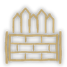Wall Foundation | Both | 150 | 10 Log, 2 Plank |  |
| Palisade | Folktails | 150 | 6 Log, 2 Plank |  |
| 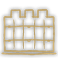Wall | Iron Teeth | 150 | 6 Log, 2 Plank |  |
| Gatehouse | Both | 450 | 30 Log, 20 Plank, 8 Gear |  |
| 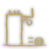Log Hoarding | Folktails | 500 | 10 Log, 10 Treated Plank |  |
| 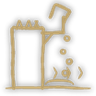Oil Hoarding | Iron Teeth | 500 | 10 Log, 10 Plank, 4 Metal Part |  |
| Wall Tower | Both | 300 | 40 Log, 30 Plank |  |
| 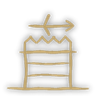Ballista Tower | Folktails | 1200 | 36 Log, 45 Plank, 9 Gear, 9 Treated Plank |  |
| Ballista Tower | Iron Teeth | 1200 | 36 Log, 45 Plank, 9 Gear, 9 Metal Part |  |
| Trebuchet Tower | Both | 1800 | 90 Log, 27 Plank, 18 Gear, 18 Metal Block |  |
| 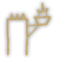Blazer | Both | 300 | 2 Log, 2 Plank |  |
| Resin Puddle | Both | 250 | 8 Pine Resin |  |

## Siege

| Building | Faction | Science | Cost | Makes |
|---|---|---|---|---|
| Field Infirmary | Iron Teeth | 800 | 30 Plank, 10 Gear, 2 Extract |  |
| 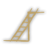Field Ladder | Both | 300 | 2 Log, 4 Plank |  |
| 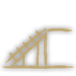Field Ramp | Both | 450 | 10 Log, 10 Plank |  |
| Battering Ram | Folktails | 600 | 40 Log, 20 Plank, 10 Metal Block |  |
| 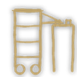Siege Tower | Iron Teeth | 600 | 40 Log, 40 Plank, 10 Metal Part |  |
| Catapult | Folktails | 800 | 30 Log, 15 Gear, 10 Treated Plank |  |
| Catapult | Iron Teeth | 800 | 30 Log, 15 Gear, 10 Metal Part |  |
| Ballista | Folktails | 1000 | 20 Plank, 10 Gear, 10 Treated Plank |  |
| Ballista | Iron Teeth | 1000 | 20 Plank, 10 Gear, 10 Metal Part |  |
| Trebuchet | Both | 1500 | 60 Log, 20 Gear, 20 Metal Block |  |

## Military

| Building | Faction | Science | Cost | Makes |
|---|---|---|---|---|
| Weaponsmith | Folktails | 150 | 20 Log, 30 Plank | Spear, Bow, Sling, Shield, Ballista bolt |
| Weaponsmith | Iron Teeth | 150 | 20 Log, 30 Plank | Spear, Bow, Sword, Shield, Ballista bolt |
| Bladesmith | Folktails | 400 | 40 Plank, 20 Gear, 10 Metal Block | Sword, Battle axe |
| Gunsmith | Iron Teeth | 400 | 40 Plank, 20 Gear, 20 Metal Part | Arquebus, Blasting Charge |
| Barracks | Both | 250 | 40 Log, 30 Plank |  |
| Archery Range | Both | 450 | 30 Log, 30 Plank |  |
| Monastery | Folktails | 600 | 40 Log, 40 Plank, 20 Paper |  |
| Monastery | Iron Teeth | 600 | 40 Log, 40 Plank, 10 Metal Part |  |
| Wagon Yard | Both | 400 | 40 Log, 30 Plank, 10 Gear |  |
| 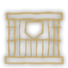Small Armory | Both | 0 | 4 Log, 2 Plank |  |
| 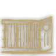Medium Armory | Both | 0 | 10 Log, 8 Plank |  |
| Stone Press | Both | 200 | 30 Log, 20 Plank, 15 Gear | Siege stone |

## Water mines

| Building | Faction | Science | Cost | Makes |
|---|---|---|---|---|
| Mine Workshop | Both | 700 | 30 Plank, 20 Gear, 20 Metal Block | Water mine |
| Mine Slipway | Both | 800 | 30 Log, 20 Gear, 10 Metal Block |  |
| Moored Mine | Both | 400 | 2 Log, 2 Plank |  |
| Fireship Dock | Both | 1200 | 40 Log, 40 Treated Plank |  |
| Mine Net | Both | 350 | 6 Log, 4 Plank |  |
| Net Winch | Both | 500 | 20 Log, 15 Plank, 10 Gear |  |

## Territory and trade

| Building | Faction | Science | Cost | Makes |
|---|---|---|---|---|
| 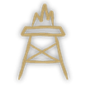Watchtower | Both | 100 | 30 Log, 20 Plank |  |
| Power Exchange | Both | 600 | 20 Plank, 20 Gear, 10 Metal Block |  |
| Trading Post | Folktails | 600 | 30 Log, 30 Plank, 20 Paper |  |
| Trading Post | Iron Teeth | 600 | 30 Log, 30 Plank, 10 Metal Part |  |
| Toll Tube Station | Iron Teeth | 800 | 40 Plank, 20 Gear, 20 Metal Block |  |
| Toll Station | Folktails | 800 | 20 Log, 40 Plank, 20 Metal Block |  |
| Troops Counter | Folktails | 200 | 2 Plank, 2 Gear, 1 Paper |  |
| Troops Counter | Iron Teeth | 200 | 2 Plank, 2 Gear, 1 Metal Part |  |

_Generated from the mod's blueprints._
