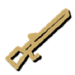
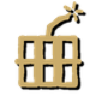
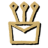
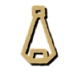
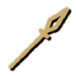
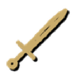

# Weapons and goods

| Good | Made from | Hours | Made in |
|---|---|---|---|
| Arquebus | 1 Metal Block, 1 Treated Plank, 1 Explosives | 4 | Gunsmith |
| Battle axe | 2 Metal Block, 1 Treated Plank | 3.5 | Armory |
| Blasting Charge | 2 Explosives, 1 Gear | 3 | Gunsmith |
| Bow | 2 Plank, 1 Log | 2.5 | Forge |
| Herbal Kit | 2 Dandelion, 1 Paper | 3 | Herbalist |
| Shield | 2 Plank, 1 Log | 3 | Forge |
| Siege stone | 1 Scrap Metal, 1 Log | 1.5 | Stone Press |
| Sling | 1 Plank, 2 Berries | 1.5 | Forge |
| Spear | 2 Plank, 1 Log | 2.5 | Forge |
| Sword | 1 Plank, 1 Metal Block | 3 | Forge |
| Water mine | 1 Explosives, 1 Metal Block | 4 | Mine Workshop |

_Generated from the mod's blueprints._
